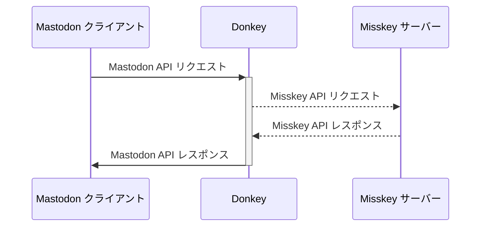

# Donkey

日本語 ･ [English](README.md)

Donkey は、Misskey向けのMastodon互換APIプロキシサーバーです。

**🏗 Donkeyは今のところ、概念実証(PoC)プロジェクトです。ユーザー向けの公式サポートはありません。ご自身の責任でご利用ください。**

## 技術的情報

DonkeyはMastodon APIリクエストを受け付け、それをMisskey APIリクエストに変換した上でMisskeyサーバーへ送信します。
そして、MisskeyからのAPIレスポンスをMastodon APIレスポンスに変換し、クライアントへ返します。

## ゴール

* Mastodon v4向けに開発されたサードパーティアプリが、Misskey v13系サーバーで完璧に動作すること

## ビルド方法

## ライセンス表記

[AGPL 3.0 (英語)](LICENSE)
