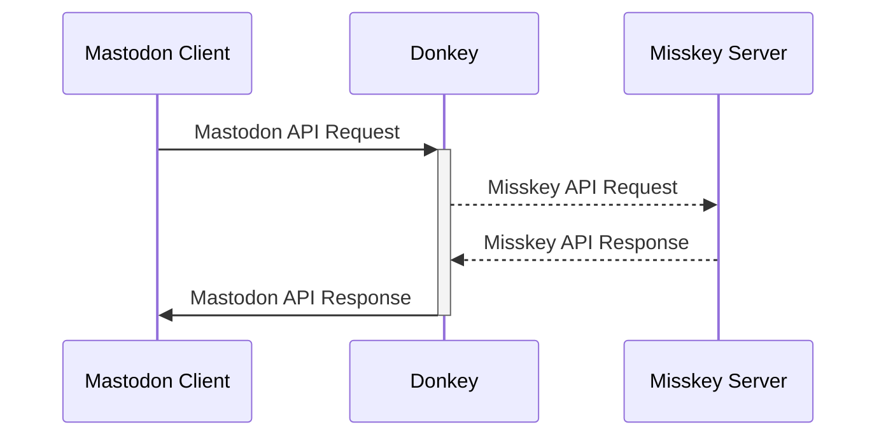

# Donkey

[日本語](README-ja.md) ･ English

Donkey is a Mastodon compatible API proxy server for Misskey.

**🏗 Donkey is a proof of concept(PoC) for the moment. We have no official support for users. Use it at your own risk.**

## Technical Information

Donkey accepts Mastodon API requests, converts them to Misskey API requests, and sends them to Misskey.
Then converts the API response from Misskey into a Mastodon API response and returns it to the client.

## Goal

* Third party apps for Mastodon v4.x work perfectly on Misskey v13.x servers

## Build

TBD

## Conrtibuting

TBD

## License

[AGPL 3.0](LICENSE)
